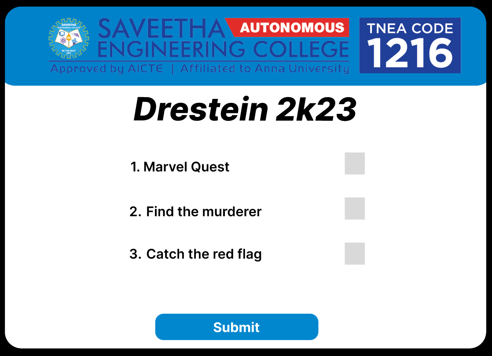

# Event Registration Web Application

## AIM:
To design, develop and deploy a web application for event registration.

## DESIGN STEPS:

### Step 1:
Create a account in figma and create a frame and select any preset size of your choice.

### Step 2:

Import necessary images and start design.
### Step 3:
Link all the webpages that you design.

### Step 4:

View your design webpages by using present icon.
### Step 5:
Fork the repository in your github and clone the repository from your github.
### Step 6:

Validate the HTML and CSS code.

### Step 7:

Publish the website in the given URL.

## PROGRAM :
### home.html:
```html
<div class="desktop-1-fcf" id="1:2">

<div class="auto-group-em8w-knX" id="SjQ8CAJVE4wu8zTJ4QeM8w">
<div class="frame-1-Gks" id="1:7"></div>
<div class="frame-3-C8j" id="10:8">
<div class="auto-group-vhc7-4wd" id="SjQ8bQ8mQ6bMgBBpdDVhc7">

<div class="auto-group-epgj-HJb" id="SjQ8ijFtNUjRtWNXs6epgj">
<p class="drestein-2k23-zio" id="10:10">Drestein 2k23</p>
<p class="register-your-profile-here-qzK" id="10:11">
<span class="register-your-profile-here-qzK-sub-0"></span>
<span class="register-your-profile-here-qzK-sub-1">Register your profile here</span>
</p>
</div>
</div>
<div class="auto-group-79yu-vXu" id="SjQ8q4QfwMVJytDL2T79yu">
<p class="create-account-3Md" id="10:12">Create Account</p>
<p class="email-MNK" id="10:41">Email</p>
</div>
<div class="auto-group-sg2w-qHV" id="SjQ8z49gauw34UJZjDSG2w">
<div class="auto-group-klhh-KyM" id="SjQ9BxyWAXueuWUik2KLHh">
<div class="frame-15-Gtb" id="10:55"></div>
<div class="auto-group-w3hu-Aj5" id="SjQ9L3aNh3asTZAsHoW3hu">
<div class="frame-13-hj1" id="10:34"></div>
<div class="frame-7-DST" id="10:19"></div>
<p class="password-95D" id="10:20">Password</p>
</div>
</div>
</div>
<div class="frame-9-dm5" id="10:21">Create account</div>
<div class="frame-16-45h" id="10:56">Login</div>
<p class="event-registration-Hj9" id="12:82">Event Registration</p>
</div>
</div>
</div>
```
### home.css:
```css
.desktop-1-fcf {
  align-items: center;
  background-color: #0187ce;
  border-radius: 5rem;
  box-sizing: border-box;
  display: flex;
  flex-direction: column;
  overflow: hidden;
  padding-top: 2.1rem;
  position: relative;
  width: 100%;

  .weblogo-01-1-H8F {
    flex-shrink: 0;
    height: 19.2rem;
    margin: 0rem 0rem 2rem 0rem;
    object-fit: cover;
    vertical-align: top;
    width: 123.8rem;
  }
  .auto-group-em8w-knX {
    flex-shrink: 0;
    height: 80.0799rem;
    position: relative;
    width: 144.4097rem;

    .frame-1-Gks {
      height: 0.6rem;
      left: 144rem;
      overflow: hidden;
      position: absolute;
      top: 78.5rem;
      width: 0.1rem;
    }
    .frame-3-C8j {
      align-items: center;
      background-color: #fafafa;
      box-sizing: border-box;
      display: flex;
      flex-direction: column;
      height: 80.0799rem;
      left: 0;
      overflow: hidden;
      padding: 1.539rem 2.204rem 3.08rem 2.204rem;
      position: absolute;
      top: 0;
      width: 144.4097rem;

      .auto-group-vhc7-4wd {
        align-items: flex-start;
        display: flex;
        flex-shrink: 0;
        margin: 0rem 39.106rem 1.399rem 0rem;
        width: calc(100% - 39.1059rem);

        .rectangle-1-kZZ {
          flex-shrink: 0;
          height: 0.4004rem;
          margin-right: 3.6947rem;
          object-fit: cover;
          vertical-align: top;
          width: 0.1015rem;
        }
        .auto-group-epgj-HJb {
          flex-shrink: 0;
          height: 18.4011rem;
          margin-top: 0.0609rem;
          position: relative;
          width: 97.1rem;

          .drestein-2k23-zio {
            color: #000000;
            font-family: Inter, 'Source Sans Pro';
            font-size: 9.6rem;
            font-style: italic;
            font-weight: 800;
            height: 11.7rem;
            left: 30.2rem;
            line-height: 1.2125;
            position: absolute;
            top: 0;
            white-space: nowrap;
            width: 66.9rem;
          }
          .register-your-profile-here-qzK {
            align-items: baseline;
            color: #0187ce;
            display: flex;
            font-family: Inter, 'Source Sans Pro';
            font-size: 5.8rem;
            font-weight: 400;
            height: 7.1rem;
            left: 0;
            line-height: 1.2125;
            position: absolute;
            top: 11.3011rem;
            white-space: nowrap;
            width: 69.2rem;

            .register-your-profile-here-qzK-sub-0 {
            }
            .register-your-profile-here-qzK-sub-1 {
              color: #0187ce;
              font-family: Inter, 'Source Sans Pro';
              font-size: 5.8rem;
              font-style: italic;
              font-weight: 400;
              line-height: 1.2125;
            }
          }
        }
      }
      .auto-group-79yu-vXu {
        flex-shrink: 0;
        height: 7.9365rem;
        margin: 0rem 59.106rem 0.364rem 47.217rem;
        position: relative;
        width: calc(100% - 106.3234rem);

        .create-account-3Md {
          color: #000000;
          font-family: Inter, 'Source Sans Pro';
          font-size: 3.5rem;
          font-weight: 700;
          height: 4.3rem;
          left: 6.7787rem;
          line-height: 1.2125;
          position: absolute;
          top: 0;
          white-space: nowrap;
          width: 26.9rem;
        }
        .email-MNK {
          color: #6a6a6a;
          font-family: Inter, 'Source Sans Pro';
          font-size: 3rem;
          font-weight: 400;
          height: 3.7rem;
          left: 0;
          line-height: 1.2125;
          position: absolute;
          top: 4.2365rem;
          white-space: nowrap;
          width: 7.6rem;
        }
      }
      .auto-group-sg2w-qHV {
        box-sizing: border-box;
        flex-shrink: 0;
        height: 20.4rem;
        margin: 0rem 34.41rem 2.7rem 0rem;
        padding-left: 29.4rem;
        width: 78.2rem;

        .auto-group-klhh-KyM {
          align-items: center;
          display: flex;
          flex-direction: column;
          height: 100%;
          width: 100%;

          .frame-15-Gtb {
            border: solid 0.1rem #000000;
            border-radius: 2.5rem;
            box-sizing: border-box;
            flex-shrink: 0;
            height: 7.9rem;
            margin: 0rem 0rem 0.6rem 0rem;
            width: calc(100% - 0rem);
          }
          .auto-group-w3hu-Aj5 {
            flex-shrink: 0;
            height: 11.9rem;
            margin-left: 0rem;
            position: relative;
            width: calc(100% - 0rem);

            .frame-13-hj1 {
              border: solid 0.1rem #000000;
              border-radius: 2.5rem;
              box-sizing: border-box;
              height: 7.9rem;
              left: 0;
              position: absolute;
              top: 4rem;
              width: 48.8rem;
            }
            .frame-7-DST {
              cursor: pointer;
              height: 3.7299rem;
              left: 2.1rem;
              position: absolute;
              top: 2.1rem;
              width: 13.9336rem;
            }
            .password-95D {
              color: #757575;
              font-family: Inter, 'Source Sans Pro';
              font-size: 3rem;
              font-weight: 400;
              height: 3.7rem;
              left: 2.0899rem;
              line-height: 1.2125;
              position: absolute;
              top: 0;
              white-space: nowrap;
              width: 13.9rem;
            }
          }
        }
      }
      .frame-9-dm5 {
        align-items: center;
        background-color: #0187ce;
        border: solid 0.1rem #0187ce;
        border-radius: 2.5rem;
        box-sizing: border-box;
        color: #ffffff;
        cursor: pointer;
        display: flex;
        flex-shrink: 0;
        font-family: Inter, 'Source Sans Pro';
        font-size: 4rem;
        font-weight: 700;
        height: 7.9rem;
        justify-content: center;
        line-height: 1.2125;
        margin: 0rem 48.206rem 0.771rem 42.996rem;
        white-space: nowrap;
        width: calc(100% - 91.2021rem);
      }
      .frame-16-45h {
        align-items: center;
        background-color: #0187ce;
        border: solid 0.1rem #0187ce;
        border-radius: 2.5rem;
        box-sizing: border-box;
        color: #ffffff;
        cursor: pointer;
        display: flex;
        flex-shrink: 0;
        font-family: Inter, 'Source Sans Pro';
        font-size: 4rem;
        font-weight: 700;
        height: 7.8rem;
        justify-content: center;
        line-height: 1.2125;
        margin: 0rem 50.076rem 2.829rem 44.926rem;
        text-align: center;
        white-space: nowrap;
        width: calc(100% - 95.0021rem);
      }
      .event-registration-Hj9 {
        color: #231c1c;
        cursor: pointer;
        flex-shrink: 0;
        font-family: Inter, 'Source Sans Pro';
        font-size: 4rem;
        font-weight: 600;
        line-height: 1.2125;
        margin-right: 7.3097rem;
        text-align: center;
        white-space: nowrap;
      }
    }
  }
}
```
### Upload.html:
```html
<div class="desktop-3-qoZ" id="10:27">
<div class="auto-group-jc4b-SYT" id="SjQAhFoPZSf4iB8eEFjc4B">

</div>
<p class="drestein-2k23-4bm" id="10:29">Drestein 2k23</p>
<p class="student-name-Knb" id="10:42">Student name</p>
<div class="auto-group-bpr9-2wu" id="SjQAzq8SSGU6uHaz24bpR9">
<div class="frame-13-kd1" id="10:33"></div>
<p class="student-email-UZ1" id="10:44">Student email</p>
<div class="auto-group-lkw5-zGT" id="SjQAmfqhbmGFA4ESA6Lkw5">
<p class="password-jjq" id="10:45">password</p>
<div class="frame-14-qXy" id="10:36"></div>
</div>
<div class="frame-15-xcb" id="10:37"></div>
<div class="auto-group-d7fq-TpF" id="SjQArLNbVTiUPBAhrZd7Fq">
<div class="rectangle-2-nLj" id="10:47"></div>
<p class="upload-your-id-card-here-uw9" id="10:49">Upload your ID Card here</p>
</div>
<div class="frame-15-DS3" id="10:50">Submit</div>
</div>
</div>
```
### Upload.css:
```css
.desktop-3-qoZ {
  align-items: center;
  background-color: #ffffff;
  border-radius: 5rem;
  display: flex;
  flex-direction: column;
  overflow: hidden;
  position: relative;
  width: 100%;

  .auto-group-jc4b-SYT {
    background-color: #0082cb;
    border: solid 0.1rem #000000;
    border-radius: 5rem;
    box-shadow: 0 0.4rem 0.4rem rgba(0, 0, 0, 0.25), 0 0.4rem 0.4rem rgba(0, 0, 0, 0.25);
    box-sizing: border-box;
    flex-shrink: 0;
    margin-bottom: 1.1rem;
    padding: 1.7rem 12.1rem 2.8rem 12.1rem;
    width: 100%;

    .weblogo-01-3-Vf9 {
      height: 19.2rem;
      object-fit: cover;
      vertical-align: top;
      width: 123.8rem;
    }
  }
  .drestein-2k23-4bm {
    color: #000000;
    flex-shrink: 0;
    font-family: Inter, 'Source Sans Pro';
    font-size: 9.6rem;
    font-style: italic;
    font-weight: 800;
    line-height: 1.2125;
    margin: 0rem 0.1rem 0.8rem 0rem;
    white-space: nowrap;
  }
  .student-name-Knb {
    color: #686565;
    flex-shrink: 0;
    font-family: Inter, 'Source Sans Pro';
    font-size: 2.5rem;
    font-weight: 400;
    line-height: 1.2125;
    margin-right: 32.7rem;
    white-space: nowrap;
  }
  .auto-group-bpr9-2wu {
    align-items: center;
    box-sizing: border-box;
    display: flex;
    flex-direction: column;
    flex-shrink: 0;
    padding: 0rem 49.8rem 2.5rem 45rem;
    width: 100%;

    .frame-13-kd1 {
      border: solid 0.1rem #000000;
      border-radius: 2.5rem;
      box-sizing: border-box;
      flex-shrink: 0;
      height: 8.1rem;
      margin-bottom: 0.7rem;
      width: 100%;
    }
    .student-email-UZ1 {
      color: #6e6b6b;
      flex-shrink: 0;
      font-family: Inter, 'Source Sans Pro';
      font-size: 2.5rem;
      font-weight: 400;
      line-height: 1.2125;
      margin-right: 29.9rem;
      white-space: nowrap;
    }
    .auto-group-lkw5-zGT {
      flex-shrink: 0;
      height: 11.2rem;
      position: relative;
      width: 100%;

      .password-jjq {
        color: #6d6d6d;
        font-family: Inter, 'Source Sans Pro';
        font-size: 2.5rem;
        font-weight: 400;
        height: 3.1rem;
        left: 2.7rem;
        line-height: 1.2125;
        position: absolute;
        top: 8.1rem;
        white-space: nowrap;
        width: 11.5rem;
      }
      .frame-14-qXy {
        border: solid 0.1rem #000000;
        border-radius: 2.5rem;
        box-sizing: border-box;
        height: 8.1rem;
        left: 0;
        position: absolute;
        top: 0;
        width: 49.2rem;
      }
    }
    .frame-15-xcb {
      border: solid 0.1rem #000000;
      border-radius: 2.5rem;
      box-sizing: border-box;
      flex-shrink: 0;
      height: 7.9rem;
      margin: 0rem 0.4rem 2.5rem 0rem;
      width: 48.8rem;
    }
    .auto-group-d7fq-TpF {
      align-items: center;
      display: flex;
      flex-shrink: 0;
      margin: 0rem 12.1rem 2.5rem 0rem;
      width: calc(100% - 12.1rem);

      .rectangle-2-nLj {
        background-color: #e3e0e0;
        border-radius: 2.5rem;
        flex-shrink: 0;
        height: 15.6rem;
        margin-right: 3.9rem;
        width: 18.3rem;
      }
      .upload-your-id-card-here-uw9 {
        color: #5d5d5d;
        flex-shrink: 0;
        font-family: Inter, 'Source Sans Pro';
        font-size: 2.5rem;
        font-weight: 400;
        line-height: 1.2125;
        margin-bottom: 0.9rem;
        max-width: 14.9rem;
      }
    }
    .frame-15-DS3 {
      align-items: center;
      background-color: #0187ce;
      border: solid 0.1rem #0187ce;
      border-radius: 2.5rem;
      box-sizing: border-box;
      color: #ffffff;
      cursor: pointer;
      display: flex;
      flex-shrink: 0;
      font-family: Inter, 'Source Sans Pro';
      font-size: 4rem;
      font-weight: 700;
      height: 7.9rem;
      justify-content: center;
      line-height: 1.2125;
      margin-right: 0.4rem;
      text-align: center;
      white-space: nowrap;
      width: 48.8rem;
    }
  }
}

```
### Register.html:
```html
<div class="desktop-4-bvB" id="10:60">
<div class="auto-group-jpm5-p2F" id="SjQBgoypeXmmhTKb9EjPm5">

</div>
<p class="drestein-2k23-7hV" id="10:62">Drestein 2k23</p>
<div class="auto-group-qwak-mX9" id="SjQC78cdWXR6x1Lri7qwAK">
<div class="auto-group-gwxh-gPD" id="SjQBmj1JPc53hp6LcLgwXh">
<p class="marvel-quest-P2j" id="10:73">1. Marvel Quest </p>
<div class="rectangle-3-J9h" id="12:76"></div>
</div>
<div class="auto-group-nsw9-ASo" id="SjQBsZAvFj8qEiGBERnsw9">
<p class="find-the-murderer-feT" id="10:74">Find the murderer </p>
<div class="rectangle-4-zgj" id="12:77"></div>
</div>
<div class="auto-group-jprp-LEo" id="SjQBxZ2bHG3nqUykd5JprP">
<p class="catch-the-red-flag-Ubu" id="10:75">Catch the red flag </p>
<div class="rectangle-5-Gnf" id="12:78"></div>
</div>
<div class="frame-15-oGo" id="10:71">Submit</div>
</div>
</div>
```
### Register.css:
```css
.desktop-4-bvB {
  align-items: center;
  background-color: #ffffff;
  border-radius: 5rem;
  display: flex;
  flex-direction: column;
  overflow: hidden;
  position: relative;
  width: 100%;

  .auto-group-jpm5-p2F {
    background-color: #0082cb;
    border-radius: 5rem;
    box-sizing: border-box;
    flex-shrink: 0;
    margin-bottom: 1.1rem;
    padding: 2.2rem 9.3rem 2.3rem 14.9rem;
    width: 100%;

    .weblogo-01-3-SC3 {
      height: 19.2rem;
      object-fit: cover;
      vertical-align: top;
      width: 123.8rem;
    }
  }
  .drestein-2k23-7hV {
    color: #000000;
    flex-shrink: 0;
    font-family: Inter, 'Source Sans Pro';
    font-size: 9.6rem;
    font-style: italic;
    font-weight: 800;
    line-height: 1.2125;
    margin-right: 0.1rem;
    white-space: nowrap;
  }
  .auto-group-qwak-mX9 {
    align-items: center;
    box-sizing: border-box;
    display: flex;
    flex-direction: column;
    flex-shrink: 0;
    padding: 7.2rem 36.3rem 2.5rem 36.3rem;
    width: 100%;

    .auto-group-gwxh-gPD {
      align-items: flex-end;
      display: flex;
      flex-shrink: 0;
      margin: 0rem 0rem 6.8rem 1.3rem;
      width: calc(100% - 1.3rem);

      .marvel-quest-P2j {
        color: #000000;
        flex-shrink: 0;
        font-family: Inter, 'Source Sans Pro';
        font-size: 4rem;
        font-weight: 600;
        line-height: 1.2125;
        margin-right: 33.3rem;
        white-space: nowrap;
      }
      .rectangle-3-J9h {
        background-color: #d9d9d9;
        flex-shrink: 0;
        height: 6.6rem;
        margin-bottom: 0.1rem;
        width: 6rem;
      }
    }
    .auto-group-nsw9-ASo {
      align-items: flex-end;
      display: flex;
      flex-shrink: 0;
      margin-bottom: 6.9rem;
      width: 100%;

      .find-the-murderer-feT {
        color: #000000;
        flex-shrink: 0;
        font-family: Inter, 'Source Sans Pro';
        font-size: 4rem;
        font-weight: 600;
        line-height: 1.2125;
        margin-right: 29.8rem;
        white-space: nowrap;
      }
      .rectangle-4-zgj {
        background-color: #d9d9d9;
        flex-shrink: 0;
        height: 6.6rem;
        width: 6rem;
      }
    }
    .auto-group-jprp-LEo {
      align-items: center;
      display: flex;
      flex-shrink: 0;
      margin-bottom: 14.7rem;
      width: 100%;

      .catch-the-red-flag-Ubu {
        color: #000000;
        flex-shrink: 0;
        font-family: Inter, 'Source Sans Pro';
        font-size: 4rem;
        font-weight: 600;
        line-height: 1.2125;
        margin: 0.1rem 29.7rem 0rem 0rem;
        white-space: nowrap;
      }
      .rectangle-5-Gnf {
        background-color: #d9d9d9;
        flex-shrink: 0;
        height: 6.6rem;
        width: 6rem;
      }
    }
    .frame-15-oGo {
      align-items: center;
      background-color: #0187ce;
      border: solid 0.1rem #0187ce;
      border-radius: 2.5rem;
      box-sizing: border-box;
      color: #ffffff;
      display: flex;
      flex-shrink: 0;
      font-family: Inter, 'Source Sans Pro';
      font-size: 4rem;
      font-weight: 700;
      height: 7.9rem;
      justify-content: center;
      line-height: 1.2125;
      margin: 0rem 13.9rem 0rem 8.7rem;
      text-align: center;
      white-space: nowrap;
      width: calc(100% - 22.6rem);
    }
  }
}
```
### Sucess.html
```html
<div class="desktop-2-qYf" id="10:2">
<div class="auto-group-gyg7-RWs" id="SjQARgR1VdcQkyN8bWGyG7">

</div>
<p class="drestein-2k23-xod" id="10:6">Drestein 2k23</p>
<p class="account-created-sucessfully-yCw" id="10:7"> account created sucessfully</p>
</div>
```
### Sucess.css:
```css
.desktop-2-qYf {
  align-items: center;
  background-color: #ffffff;
  border-radius: 5rem;
  box-sizing: border-box;
  display: flex;
  flex-direction: column;
  overflow: hidden;
  padding-bottom: 39.6rem;
  position: relative;
  width: 100%;

  .auto-group-gyg7-RWs {
    background-color: #0082cb;
    border-radius: 5rem;
    box-sizing: border-box;
    flex-shrink: 0;
    margin-bottom: 4.2rem;
    padding: 2.2rem 14.5rem 2.3rem 9.7rem;
    width: 100%;

    .weblogo-01-2-Jj5 {
      height: 19.2rem;
      object-fit: cover;
      vertical-align: top;
      width: 123.8rem;
    }
  }
  .drestein-2k23-xod {
    color: #000000;
    flex-shrink: 0;
    font-family: Inter, 'Source Sans Pro';
    font-size: 9.6rem;
    font-style: italic;
    font-weight: 800;
    line-height: 1.2125;
    margin: 0rem 4.6rem 15.6rem 0rem;
    white-space: nowrap;
  }
  .account-created-sucessfully-yCw {
    color: #000000;
    flex-shrink: 0;
    font-family: Inter, 'Source Sans Pro';
    font-size: 6.5rem;
    font-weight: 400;
    line-height: 1.2125;
    margin-right: 8.1rem;
    white-space: nowrap;
  }
}
```
## OUTPUT:




## Result:
Thus the program To design, develop and deploy a web application for event registration is completed successfully.
